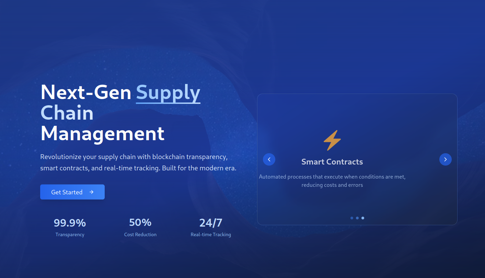
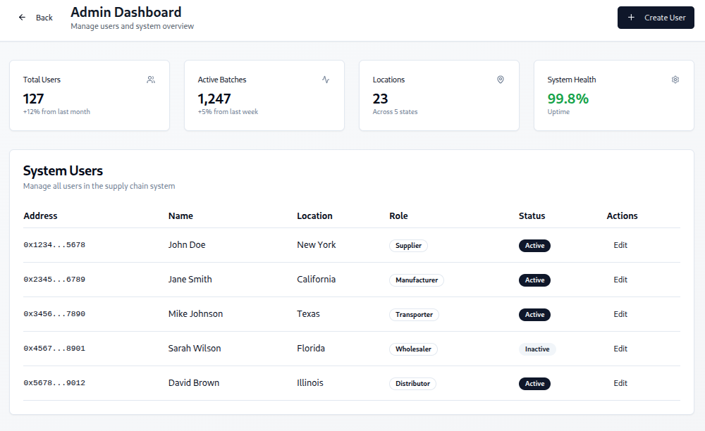
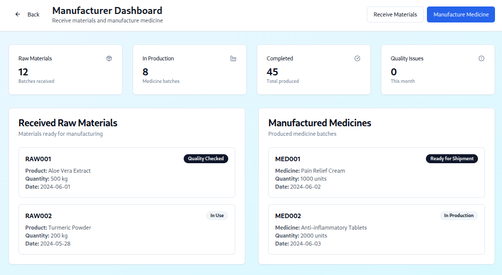
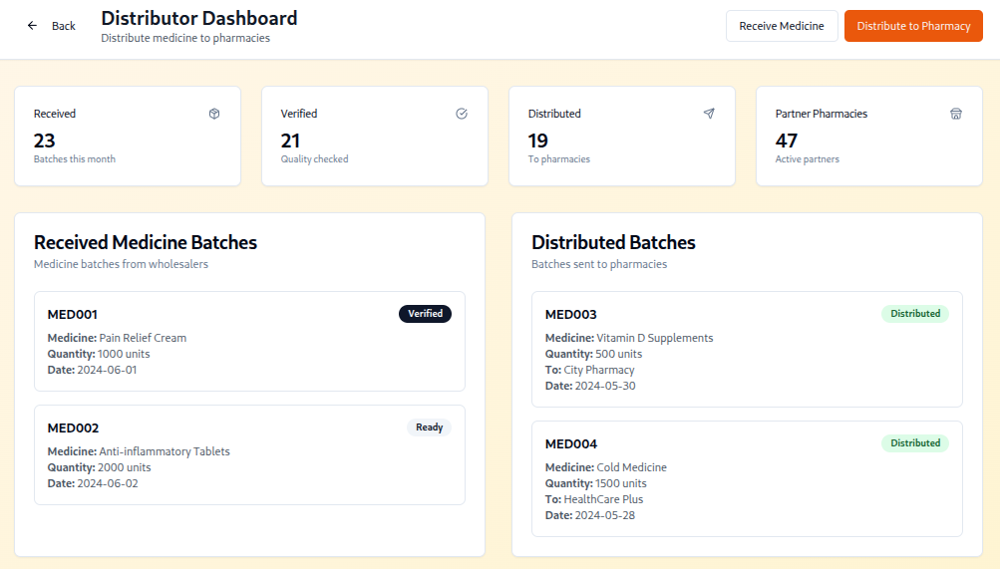
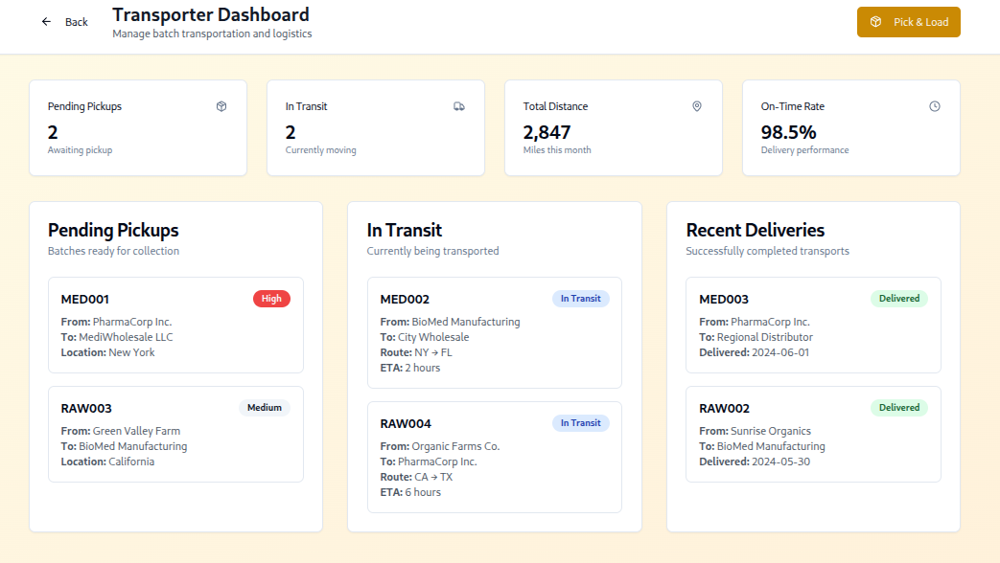
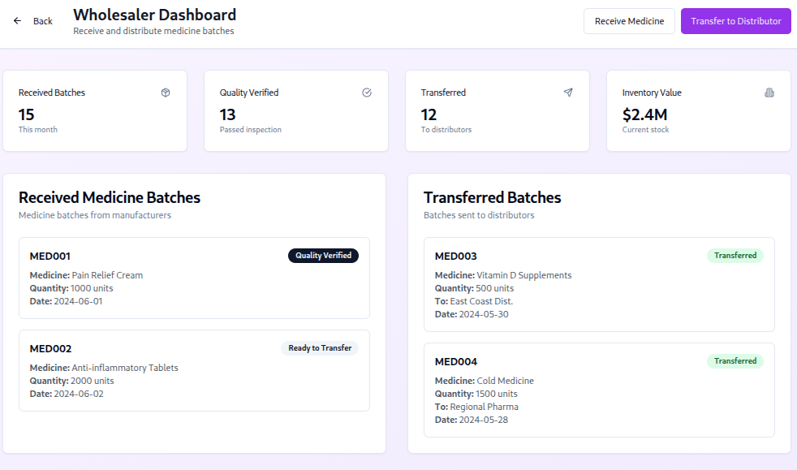
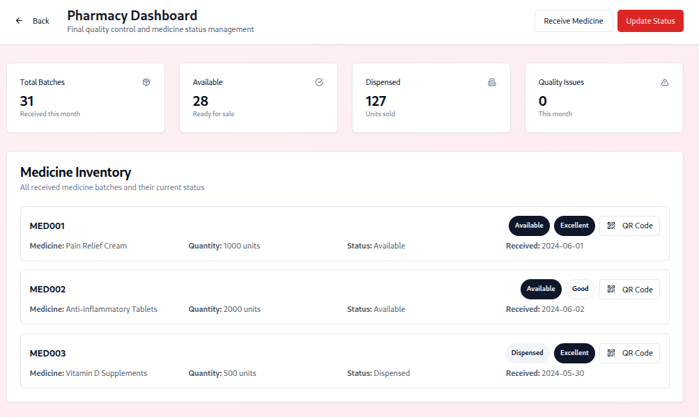
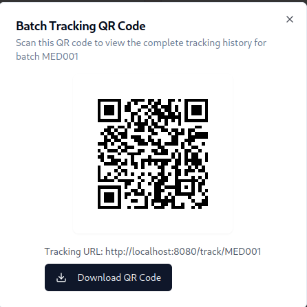
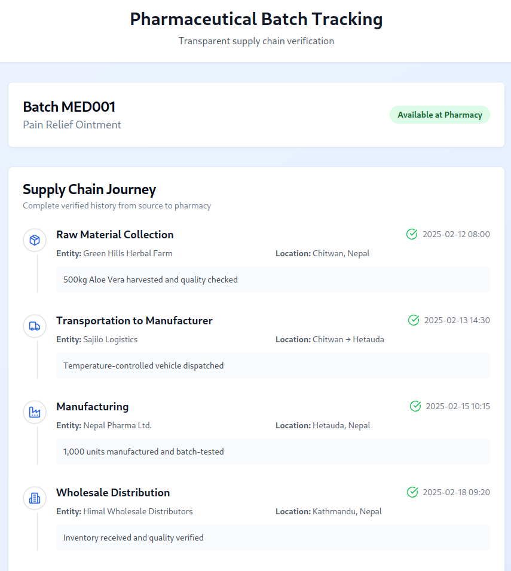

# 📦 Supply Chain Management on Blockchain

This project implements a decentralized **Supply Chain Management System** using **Solidity** and blockchain technology. It tracks the lifecycle of pharmaceutical products and raw materials across manufacturers, distributors, wholesalers, pharmacies, transporters, and admins. The backend is developed using **Foundry**, and the frontend is a fully interactive DApp.

---

## 🛠️ Project Structure

### 🔗 Backend (Smart Contracts)

Built using **Foundry** for modular and high-performance smart contract development.

#### ✅ Features Implemented

- **Project Initialization**
  - Foundry setup for Solidity development.

- **Raw Material Contract**
  - Creation and management of raw materials.

- **Medicine Handling Contract**
  - Tracks manufacturing, packaging, and batch information of medicines.

- **Core Supply Chain Logic**
  - Role-based system: manufacturer, distributor, wholesaler, transporter, pharmacy, and admin.
  - Full lifecycle tracking of pharmaceutical products.
  - Immutable transaction logs for each step.

- **Wholesaler ↔ Distributor Supply Flow**
  - Smart contract logic to manage transactions and delivery.

- **Distributor ↔ Pharmacy Supply Flow**
  - Tracks product supply and distribution between entities.

---

### 🌐 Frontend (DApp)

Provides an intuitive and role-specific interface for interacting with the blockchain.

#### ✅ Features Implemented

- **Role-Based Dashboards** (Fully Functional)
  - **Admin Dashboard**: User registration, role assignment, system overview.
  - **Manufacturer Dashboard**: Create medicines, assign batches, raw material intake.
  - **Distributor Dashboard**: Accept, dispatch, and track shipments.
  - **Wholesaler Dashboard**: Manage requests, fulfill orders.
  - **Transporter Dashboard**: Update delivery status, view assignments.
  - **Pharmacy Dashboard**: Accept deliveries, verify product lineage.

- **QR Code Integration**
  - Each product/batch is assigned a scannable QR code.
  - Scanning leads to a modal/page showing complete batch/product details from the blockchain.

- **Product Information Display**
  - Display of transaction history, batch details, origin, and destination using on-chain data.

- **Reusable UI Components**
  - Consistent design and code reuse using components like:
    - `Input`, `Button`, `Form`, `Dialog`, `Alert`, `Pagination`, and more.

- **Wallet Integration**
  - Role-based login using MetaMask.
  - Blockchain transaction signing and user authentication via wallet address.

---

## 🚀 Getting Started

### Prerequisites

- [Foundry](https://book.getfoundry.sh/)
- [Node.js](https://nodejs.org/)
- [MetaMask](https://metamask.io/)

### Backend (Smart Contracts)

```bash
forge build        # Compile contracts
forge test         # Run tests

```

### Backend (Smart Contracts)
```bash
npm install        # Install dependencies
npm run dev        # Start frontend on localhost
```


### Folder Structure
```bash
/contracts        # Solidity contracts
/frontend         # Frontend code (React/Next.js)
/scripts          # Deployment scripts
/test             # Smart contract tests
```

### Contributors
```bash
Srijit - Smart contract and backend developer
Rishav - Smart contract and backend developer
Sumit - Frontend developer
```

## 📸 Screenshots

### 🛍️ Home Page


### 🛍️ Admin Dashboard


### 🏭 Manufacturer Dashboard


### 🏭 Distributor Dashboard


### 🏭 Transporter Dashboard


### 🏭 Wholesaler Dashboard


### 🏭 Pharmacy Dashboard



### 📦 QR Scan 


### 📦 QR Scan Result



### Inspiration

This project was built to ensure transparency, accountability, and traceability in the pharmaceutical supply chain using blockchain technology.